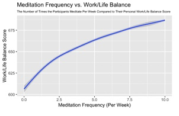
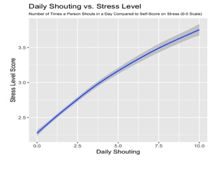
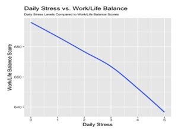
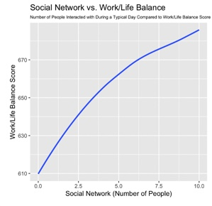

Data Exploration and Visualization:
To gain a deeper understanding of the relationships between these variables, I used data visualization techniques. The visualizations of meditation frequency, daily stress, and social network size against work/life balance scores provided valuable insights into the potential trends and patterns in the data.

Meditation Frequency vs. Work/Life Balance:

Daily Shouting vs. Stress Level:

Daily Stress vs. Work/Life Balance:

Social Network vs. Work/Life Balance:

